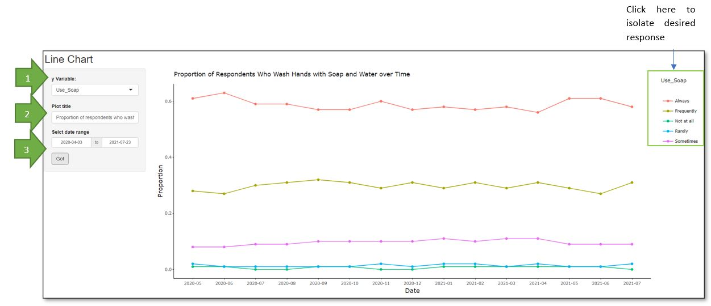
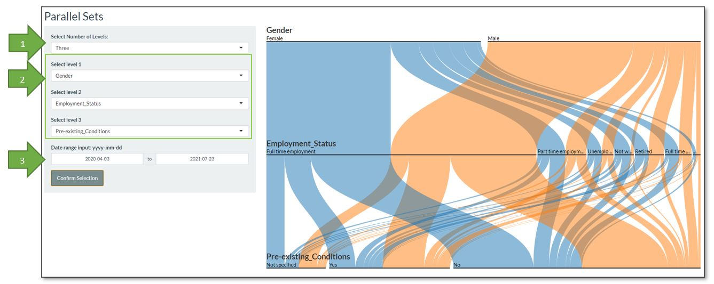

<style>

body{
  background-color: #EBEDEF;
  font-family:helvetica;
}
</style>

```{r setup, include=FALSE}
knitr::opts_chunk$set(fig.retina = 3,
                      echo = FALSE,
                      eval = TRUE,
                      message = FALSE,
                      warning = FALSE)
```

## Introductory Page

This introductory page describes the application and provides an overview on application navigation.


## Exploratory Data Analysis (EDA)

### Bar Chart
The bar chart serves as a tool to visualize the proportion of the selected x-variable as well as the breakdown of characteristics in terms of selected y-variable. The data is filtered to exclude respondents which did not specify a response (NULL).

[1] Select any combination of x and y-variables to apply to the data from the sidebar panel.

[2] Select the response collected for each symptom to visualize the proportion of respondents who exhibited such symptoms similar to the Covid-19 virus.

### Line Chart
Line charts allow users to visualize trends and patterns of change. Users are able to select which variable they wish to visualize. Furthermore, the interactive line chart allows users to isolate the responses they wish to view. Users can mouseover the plot to see the detailed proportion.



1. Select the variable to visualize from the sidebar panel.
2. Include a plot title if desired.
3. Select "Confirm Selection" to generate the Line Chart.

### Parallel Sets
Parallel Sets allow users to visualize flows from one set of values to another, hence observing the distributions between categories. The horizontal bars represent the possible categories within each dimension and its length is proportionate to the size of the category.Users are able to select up to five dimensions and the select the categories they wish to visualize. Furthermore, the interactive parallel set also allows users to reorder the categories. Users can also mouseover the plot and select either alpha or size to reorder the dimensions by alphabetical order and frequency respectively.



1. Select number of levels you wish to visualize.
2. Select the variables you wish to visualize.
3. Select the date range you wish to visualize.
4. Click on "Confirm Selection" to apply the selections.


