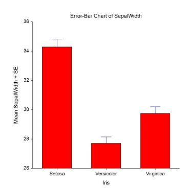
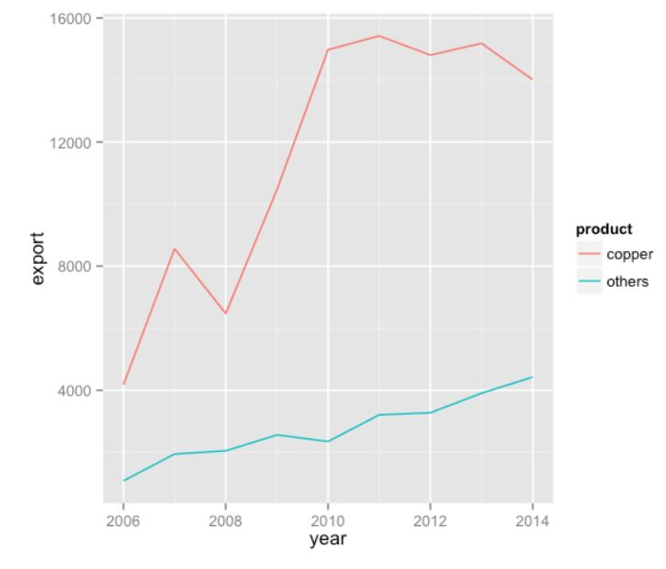
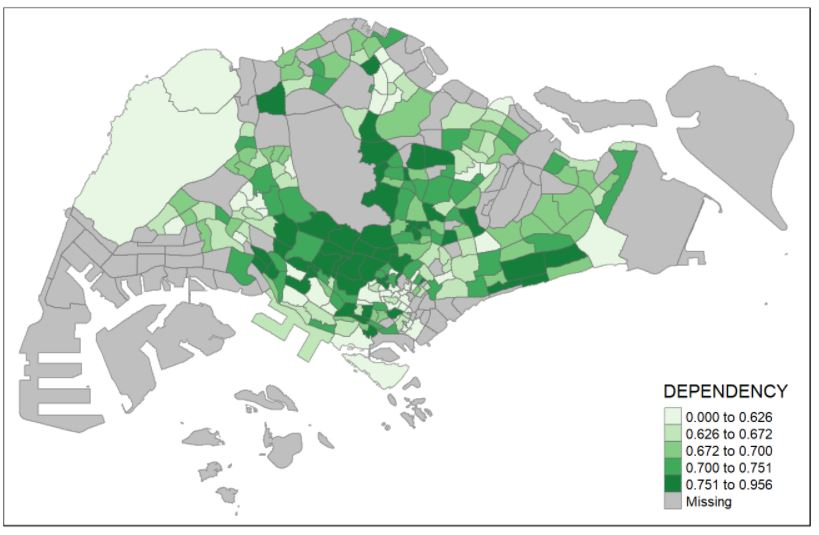

<style>

body{
  background-color: #EBEDEF;
  font-family:helvetica;
}
</style>

```{r setup, include=FALSE}
knitr::opts_chunk$set(fig.retina = 3,
                      echo = FALSE,
                      eval = TRUE,
                      message = FALSE,
                      warning = FALSE)
```

# Introduction

With the onset of the Covid-19 pandemic since 2019, nations have been scrambling to gather as much data as possible on this novel virus. In a bid to contain the spread, nations have implemented various measures, with most of these approaches centered on the role of an individual to practice preventive behaviours. These measures range from being mandatory (requirement to wear masks once leaving the house) to those which are highly encouraged (proper handwashing). With the implementation of these approaches, daily behaviours as we know it have slowly evolved.

Understanding how perceptions and behaviours have changed in critical in determining the success of Covid-19 measures. Afterall, it is not enforcement that will determine if measures introduced by the government succeed or fail, but the behaviour of the people. A common approach is to collect data from representative surveys, Most of these survey fieldwork and analysis are performed independently for various studies and tend to be on a smaller scale.

Despite the effort and expense on such research initiatives, the real world practice of using these survey data tends to be confined to the particular study and bulk of the data collected is left untapped for insights. The charts presented in the analysis are typically confined to static charts which provide summarized information to the user. They tend to be highly aggregated with the granular details presented in supplementary charts. Moreover, these reports tend to use generic templates and ignore several best practices in statistical analysis and data visualization. This may be due to a lack of ability of non-analytics professionals to engage with data.

 
# Motivation & Objective 

This research and development is motivated by the lack of easy to use interactive tools for non-technical users to visualize the data collected and perform analysis on them. Hence this tools aims to fill this gap so as to allow these users such as a government Covid-19 taskforce practitioner to i) maximise the usage of the survey data collected, ii) be self-reliant in generating insights from this data. We have identified that one of the main difficulties these non-technical users face when attempting to generate such insights and visualizations independently is that they may not know how to update the codes to generate alternative views or to achieve visualizations of various levels of aggregation. The tool was thus aimed to support the following requirements:

1) Visualize data of different levels of aggregation, with minimal technical knowledge required

2) Visualize trends and patterns among responses

3) Ability to display detailed records on-demand


# Data Source 

The data was collected by [YouGov in partnership with the Institute of Global Health Innovation (IGHI) at Imperial College London to gather global insights on people’s behaviours in response to COVID-19](https://github.com/YouGov-Data/covid-19-tracker).


# Methodology & Approach

We have brainstormed on the following visualizations to be included in the application:

## Bar Charts

Bar charts present categorical data with rectangular bars with lengths proportional to the values that they represent. They are effective in helping the user compare individual values to one another. To help the user visualize the variability of data, we have also added an option to include 95% confidence error bars into the visualization.



## Line Charts

Line charts display information as a series of data points connected by straight line segments. They are effective in their ability to show trends and patterns of change[5]. 



## Chloropeth Map

Albeit small in terms of geographical area, the vast demographic range of the population coupled with the pace of change in the age of the internet asserts that we pay attention to how the results vary from region to region within the country. A choropleth map provides us with an easy way to visualise such metrics. A good way to combat the issue of varying populations in different regions is to normalise the results and hence derive the “density” of the results in any particular area.



## Latent Class Analysis (LCA)

LCA is an unsupervised clustering algorithm used for identifying class memberships based on categorical variables. A good LCA classification can answer a lot of questions within one visualisation and can lead to quicker and more robust decision making. We aim to classify the respondents based on their means and patterns of consuming media. Since the survey consists of multiple parameters, at times it be a challenge to identify the parameters that should be looked into while carrying out targeted media marketing. LCA, inherently unsupervised, helps solve this problem by creating patterns of association and calculation based on their maximum likelihoods.


# Timeline 

Tasks Name | Start Date (DD/MM/YY) | End Date (DD/MM/YY) | Assigned To | % Completion 
 :----:|:------:|:--------:|:-----:|:-----:|
Formulate Project details | 05/06/21 | 08/06/21 | All | 99.9% 
Project consultation with Prof | 11/06/21 | 11/06/21 | All | 0%
Refine project scope and ideas | 12/06/21 | 20/06/21 | All | 0% 
Complete project proposal and publish on Netlify page | 12/06/21 | 20/06/21 | All | 0% 
Data Preparation | 21/06/21 | 30/06/21 |All | 0% 
Draft Application Features | 18/07/21 | 23/07/21 | All | 0%
Creation of application on R Shiny | 24/07/21 | 31/07/21 | All | 0% 
Draft Poster Design | 25/07/21 | 31/07/21 | All | 0%
Application refinement | 01/08/2021 | 14/08/21 | All | 0% 
Draft final report, including user guide | 01/08/2021 | 14/08/21 | All | 0% 
Finalise artifact | 01/08/2021 | 14/08/21 | All | 0% 
Update Netlify | 09/08/2021 | 14/08/21 | All | 0% 
Submission of final application, user guide, project poster, research paper and artifacts | 15/08/21 | 15/08/21 | All | 0% 


# Packages 

Package | Description |
 :----:|:------:|
Shinydashboard | Interactive web applications for data visualization
Shiny | Interactive web applications for data visualization
Tidyverse | Data manipulation
Leaflet | Create maps within the application
Dplyr | Data manipulation
Sf | Create maps within the application
ggplot2 | Plot visualizations and EDA
Plotly | Plot interactive visualizations
Shinythemes | Select themes for Shiny application
mclust | Perform Latent Class Analysis


